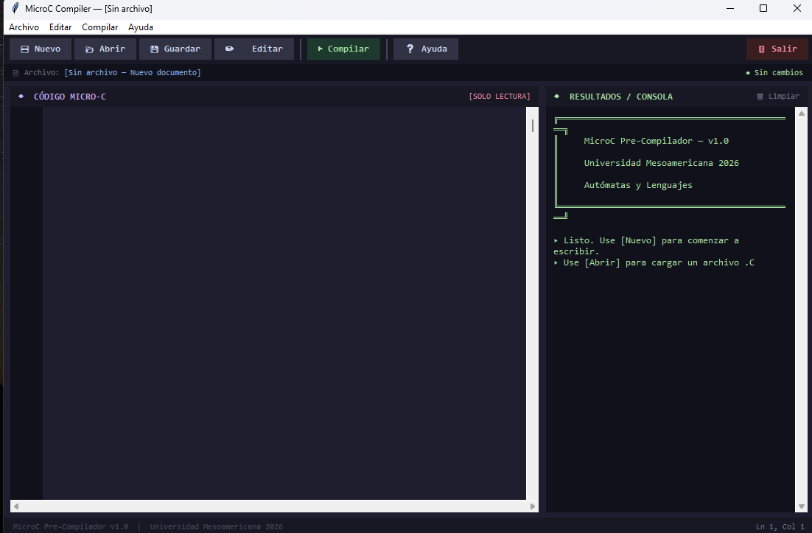
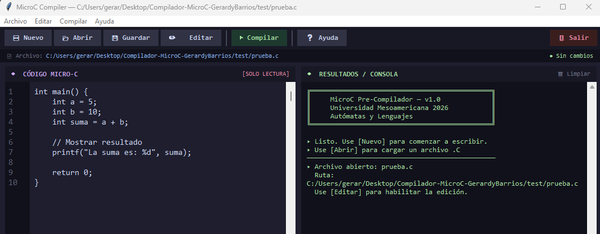

# Documentacíon del Proyecto-Pre-Compilador MicroC
El proyecto desarrollado para el curso de Autómatas y Lenguajes de la Universidad Mesoamericana

Mi objetivo del sistema es simular el funcionamiento básico de un pre-compilador para el lenguaje MicroC, permitiendo analzar código fuente y detectar posibles errores antes de su compilación.

El programa fue desarrollado en Python y cuenta con una interfaz gráfica que facilita la interacción con el usuario para cargar archivos, visualizar el contenido del codigo y analizar su estructura. 

## Manual de Usuario 
1. Inicio del programa 
* Abrir la carpeta de proyecto llamada -Compilador-MicroC-GerardyBarrios-
* Ejecuta el archivo principal del programa llamada -src-
* Se abrirá la ventana principal del código Pre-Compilador MicroC.
* Puedes darle en la terminal y poner el comando -python src/microc_compiler.py- y asi se abrira la interfaz grafica del Pre-compilador.

## Cargar un Archivo del Código
*

